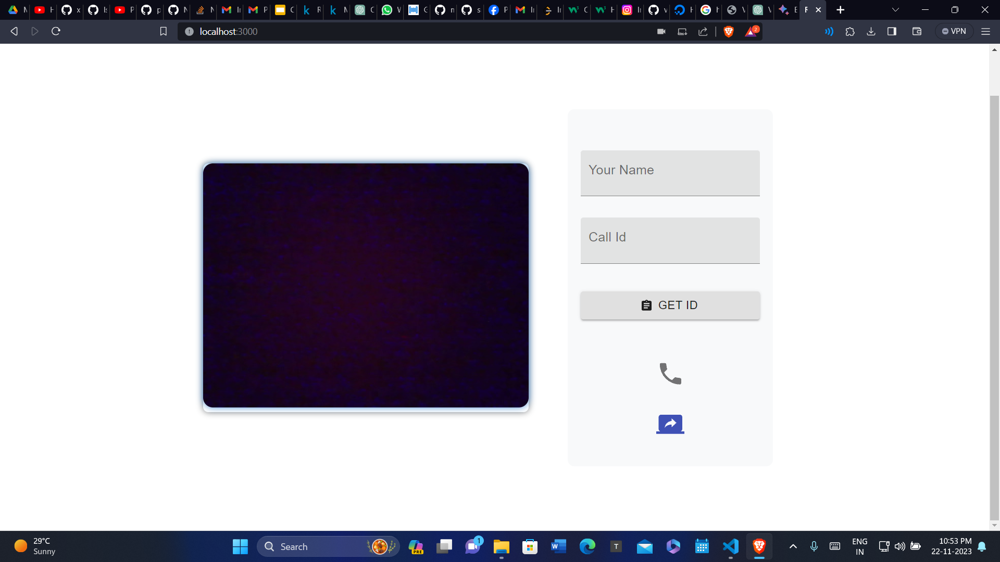
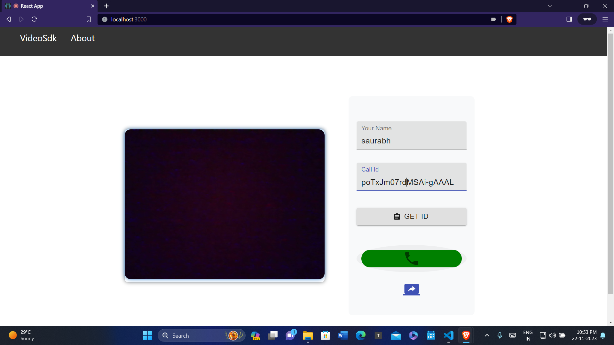
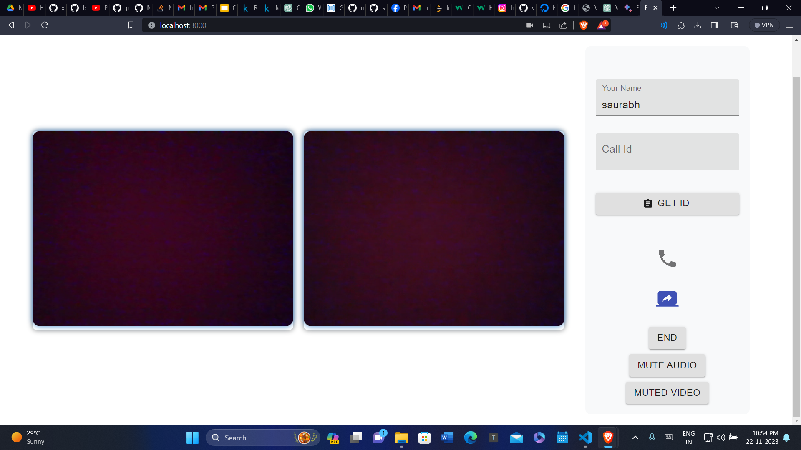

# Video Chat App 

This is a simple video chat application built with React, Express, and Socket.IO.

## Features

- Initiate and answer video calls
- Toggle audio and video mute during a call
- Responsive UI for a seamless user experience

## Getting Started

### Prerequisites

- Node.js and npm installed for package.json 
- Modern web browser with WebRTC and screen-sharing support

### Installation proccess

1. Clone the repository:

   ```bash
   git clone https://github.com/Saurabh3652/videsdk.git
   cd videosdk
2. for package.json file in particular folder 
    ```bash
    npm install
3. In frontend folder 
    ```bash
    nodemon server.js

### Run demo

1. open localhost:3000 on 2 diffrent window 
    Use Get ID to copy userID


2. Then you can enter that id in diffrent window and click on call button

3. you will see the answer button on screen of other user. click on that to connect the call
